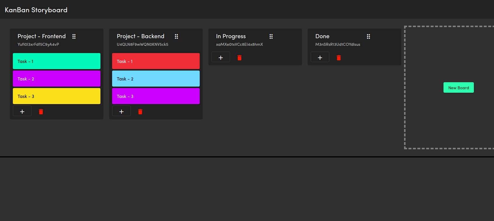

# KanBan StoryBoard App

<p align="center">



</p>

## Usage

1.  Run

- `git clone https://github.com/siddhantmahalle/Kanban-Storyboard-App.git kanban`
- `cd kanban`
- `npm install`

2.  Create a project at https://firebase.google.com/ and grab your web config:


3.  Add the config to your Angular environment

#### src/environments/

Update the `environment.prod.ts` and `environment.ts` files. 

```typescript
export const environment = {
  production: false,
  firebase: {
    apiKey: 'APIKEY',
    authDomain: 'DEV-APP.firebaseapp.com',
    databaseURL: 'https://DEV-APP.firebaseio.com',
    projectId: 'DEV-APP',
    storageBucket: 'DEV-APP.appspot.com',
    messagingSenderId: '...',
    appId: '...',
  }
};
```


5.  Run `ng serve`
